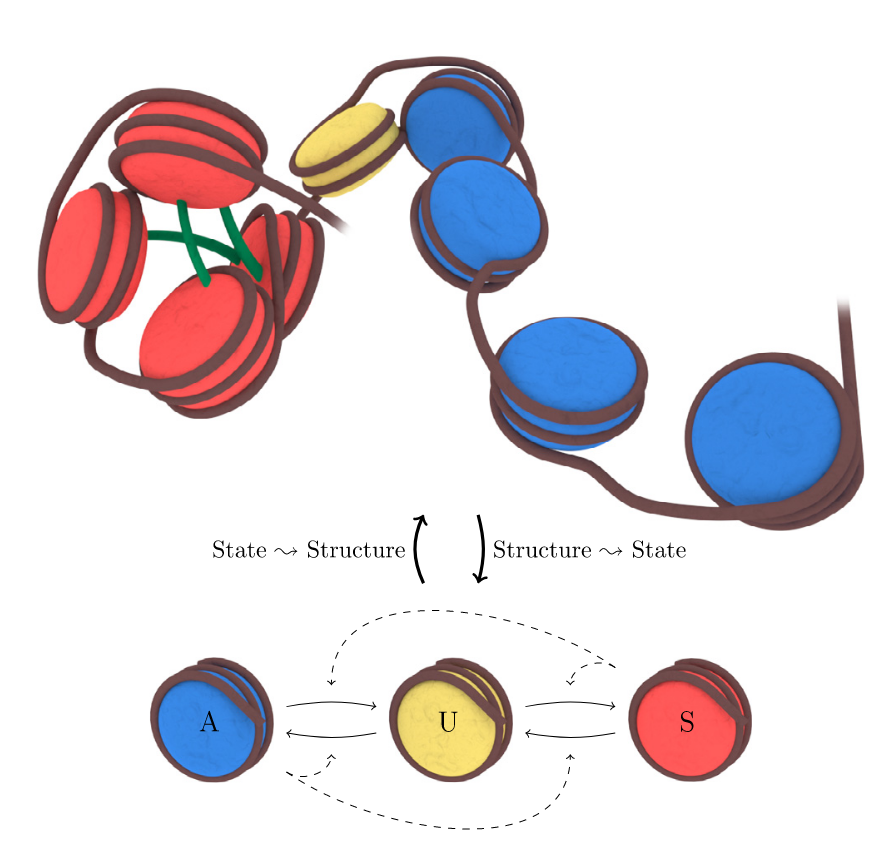

# Model of a 3 states copolymer with monomers changing states.
## Biologically : polymer of chromatine with a 3 states model of nucleosomes.

### 1st step
Launch  <code>python jupyter notebook create_Initfile.ipynb</code> to create an InitFile.txt (one file like this is already present with 100 monomers)

### 2nd step
Modify the input.lammps file as needed for the parameter of your simulation.

### 3rd step
Launch the simulation using the terminal : <code>lmp -in input.lammps</code>

### 4th step
Visualize your copolymer using Ovito or VMD (see online). Open the file dump.lammpstrj with the software you prefer.

### 5th step
Enjoy the beauty of the simulation!!

